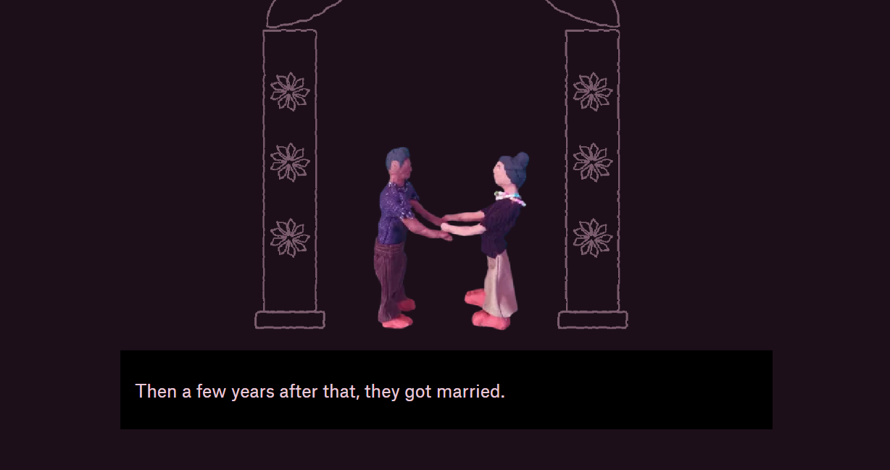
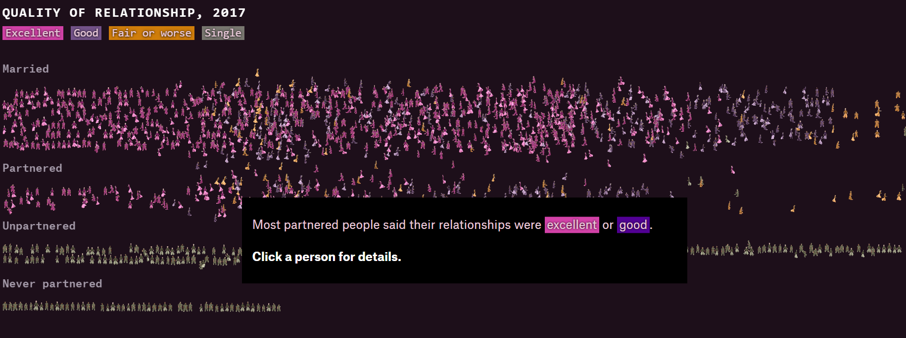
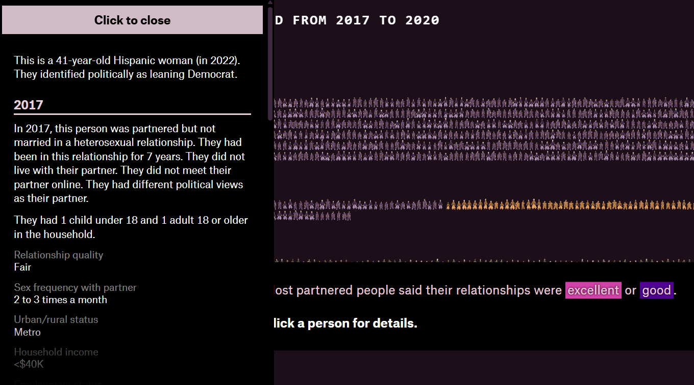

# Análisis "A love story"

## Nombre y URL

**Nombre:** A love story
**Autor:** Alvin Chang
**URL:** [https://pudding.cool/2026/06/love-story/](https://pudding.cool/2026/06/love-story/)

## Descripción de la historia

*A love story* es una webstory  que aborda las relaciones románticas y los cambios que han experimentado con el paso del tiempo, se concentra especialmente a partir del impacto de la pandemia del COVID-19.

Se nos presentan dos protagonistas: Henry y Mary, una pareja que permite introducir el tema de manera cercana. A medida que avanza, esta historia se va conectando con datos reales de investigaciones sobre relaciones. La webstory utiliza información de más de 1.000 personas encuestadas por investigadores de Stanford en distintos momentos, lo que permite observar cambios en sus relaciones antes, durante y después de la pandemia.

Además, aborda temas como la satisfacción en las relaciones, las separaciones y las distintas formas en que las personas conocen a sus parejas.

## Me pareció interesante porque...

Me pareció interesante la forma en que toma una historia que podría perfectamente ser solo un paper y tener un enfoque unicamente estadístico y lo transforma en una historia mucho más fácil y entretenida de consumir. En vez de comenzar directamente con cifras y datos duros, utiliza una historia de amor para captar la atención del lector y luego conecta esa experiencia con datos sobre un fenómeno social más amplio.

También destacaría la combinación de texto con los elementos interactivos, me gustó mucho el que se pudiera seleccionar una "personita" y poder conocer los datos asociados. Estos recursos hacen que la experiencia sea más dinámica y permiten que el lector participe en el descubrimiento de la información.

Antes de seleccionar la personita***

Personita seleccionada***
## Sobre la narrativa...

La webstory utiliza una estructura basada en el desplazamiento hacia abajo, tipo scroll, por lo que el avance del lector también significa un avance de la historia. Primero presenta a los protagonistas y su relación, para después incorporar el contexto de la pandemia y ampliar la historia hacia datos duros.

Encuentro interesante también que los datos no salgan de golpe una vez que uno baja, sino que aparecen de manera progresiva y acompañan lo que se va narrando.

## Efectividad para transmitir información...

Considero que *A love story* es funciona porque consigue presentar información compleja de una manera cercana y comprensible. La historia permite generar interés antes de introducir los datos. Su fuerte es la combinación entre el aspecto humano y datos cuantitativos. Esto evita que la información se sienta distante y permite comprender cómo un fenómeno social puede afectar las experiencias personales.

Como aspecto negativo, la cantidad de información puede hacer que la historia sea un poco extensa para algunos. Sin embargo, la estructura y los elementos interactivos ayudan a mantener el interés. Pienso que se aprovechan bien las posibilidades de una webstory ya que se combina narración, datos y recursos visuales en una experiencia coherente.
